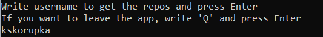

# allegro-summer-experience-2022
My email in recruitment process: kskorupka01@gmail.com
## Instalation/start-up
1. Clone the repository to your local environment
2. Go to allegro-summer-experience-2022/AllegroSummerExperience/
3. Open the AllegroSummerExperience.sln file using Visual Studio
4. Run the project
## How to use the app
### 1. Write the username
In the command prompt you will see:  
  
**Write username to get the repositories and press Enter  
If you want to leave the app, write 'Q' and press Enter**  
  
Write the username you are looking for and press the Enter button.  
  
### 2. Read the result.

