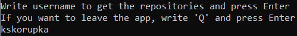

# allegro-summer-experience-2022
My email in recruitment process: kskorupka01@gmail.com  
Chosen exercise: **Zadanie nr 3. Software Engineer / Data Platform Engineer / .NET Software Engineer / DevOps Engineer**
## Instalation/Start-up
### Using Visual Studio to open the project
1. Clone the repository to your local environment
2. Go to allegro-summer-experience-2022/AllegroSummerExperience/
3. Open the AllegroSummerExperience.sln file using Visual Studio
4. Run the project  
### Using releases to run the .exe file
1. Go to releases section (you may find it on the right side in this repository).
2. Expand the Assets.
3. Click on *AllegroSummerExperience.zip* and download it.
4. Unzip the file in your local environment.
5. Open the directory.
6. Run the *AllegroSummerExperience.exe* file.  
*Warning:* If your system will not allow you to open the file, go to the advanced settings and allow your system to open the file.

## How to use the app
### 1. Write the username
In the command prompt you will see:  
  
**Write username to get the repositories and press Enter  
If you want to leave the app, write 'Q' and press Enter**  
  
Write the username you are looking for and press the Enter button.  
  
### 2. Read the result.
  
  

Firstly, the list of the user's repositories will be shown. Each repository is described by name, list of languages and bytes of code in used language.  
Secondly, you will be able to see the user's important data: login, full name, bio and list of languages with bytes of code in used language.  
#### Errors occuring while processing repositories

  
  
If you see such error, there are two likely situations:
1. Given username was incorrect, so the application is not able to find such user.
2. You may have connection problems.
3. Rate limit has been reached.

Make sure that none of this situations may happen. Please, press any button and try again.

### 3. Press any button.
If you would like to review another user, press any button and follow the **1st instruction**.

### 4. Leave the application.
If you would like to leave the app, write **Q** (without any white characters) and press the Enter.  
_Warning:_ **q** or any other message will not be recognised. The app will be trying to find its repository.  

## Comments
Unfortunately, the application cannot deal with huge amount of requests due to the *rate limit*. If you have reached the limit, please wait for a while to use the application again.
