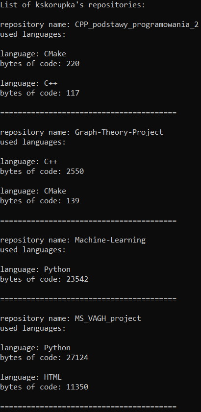

# allegro-summer-experience-2022
My email in recruitment process: kskorupka01@gmail.com
## Instalation/Start-up
1. Clone the repository to your local environment
2. Go to allegro-summer-experience-2022/AllegroSummerExperience/
3. Open the AllegroSummerExperience.sln file using Visual Studio
4. Run the project
## How to use the app
### 1. Write the username
In the command prompt you will see:  
  
**Write username to get the repositories and press Enter  
If you want to leave the app, write 'Q' and press Enter**  
  
Write the username you are looking for and press the Enter button.  
  
### 2. Read the result.
  

Firstly, the list of the user's repositories will be shown. Each repository is described by name, language and bites of code in used language.  
Secondly, you will be able to see the user's important data: login, full name, bio and list of languages with bited of code in used language.  

### 3. Press any button.
If you would like to review another user, press any button and follow the **1st instruction**.

### 4. Leave the application.
If you would like to leave the app, write **Q** (without any white characters) and press the Enter.  
_Warning:_ **q** or any other message will not be recognised. The app will be trying to find its repository.  

## Comments
Unfortunately, the application cannot deal with huge amount of requests due to the *rate limit*. If you have reached the limit, please wait for a while to use the application again.
